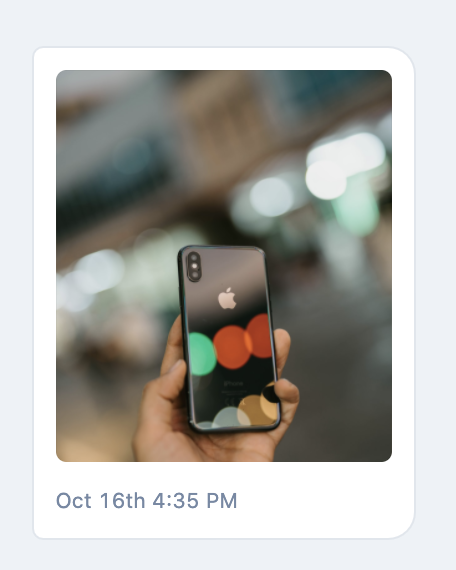
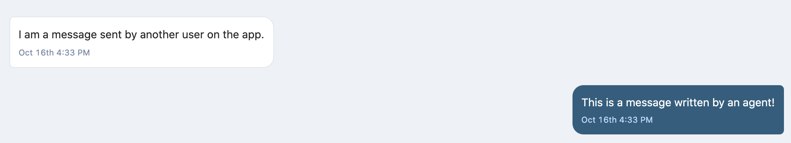

# Generic Message Component Challenge

## Estimated Duration: 1 Hour

We personally don't recommend going on beyond this 1 hour as we wouldn't want you to feel overwhelmed with the interview process.

# Context

We are developing a simple messaging application similar to whatsapp that allows users to talk to other users with text. However we start to notice users asking to send in other mediums such as images, files, videos, etc. **But given our current implementation of if/else statements this is not a scalable approach and definitely isn't maintainable by other developers!**

For example our component currently looks like this:

```typescript
// This is a contrived example
// ! We don't want this!
function Message: React.FC ({type, content}) {
    if(type === 'text') return (<span>{content}</span>)
    else if(type === 'file') return (<a download href="...">...</a>)
}
```


# Goal

**You should develop a generic message component that takes in a message and render the correct UI.** You will be given a set of conversation data which you can find in `src/fixtures/conversation` and the corresponding types in `src/types/messages` (we assume that you already know how to fetch data from an api so we've abstracted that out)

**Please take inspiration on how compound components work: https://components.looker.com/getting-started/extending/**

There are 3 message types that we want to support, these include:

1. **Text** (both as a sender and receiver)
2. **Image** (Should show a preview)
3. **Attachment** (these are just PDF attachments)

If you need some references of what they might look like you can find them below.

## Image Message



## Text Message



## Attachment

We'll leave this to your imagination!

# Test Cases

### All Messages

- Should display on the left if not from an `agent`
- Should display on the right if from an `agent`
- Should include a readable timestamp

### Text

- Should show the text content

### Image

- Should show the image as a preview

### Attachment

- Should show a download button to download the attachment.

# Before you get started!

There is some predefined data inside the `src/fixtures` folder which you will need to use so you don't need to define the data structures yourself.

**Also** If you're not familiar with typescript that's ok, give it your best shot!

# Extra Credit

- Write the interfaces for the data
- How would you implement test cases for your components?

# Running your App

This project was bootstrapped with [Create React App](https://github.com/facebook/create-react-app).

## Available Scripts

In the project directory, you can run:

### `yarn start`

Runs the app in the development mode.<br />
Open [http://localhost:3000](http://localhost:3000) to view it in the browser.

The page will reload if you make edits.<br />
You will also see any lint errors in the console.

### `yarn test`

Launches the test runner in the interactive watch mode.<br />
See the section about [running tests](https://facebook.github.io/create-react-app/docs/running-tests) for more information.
